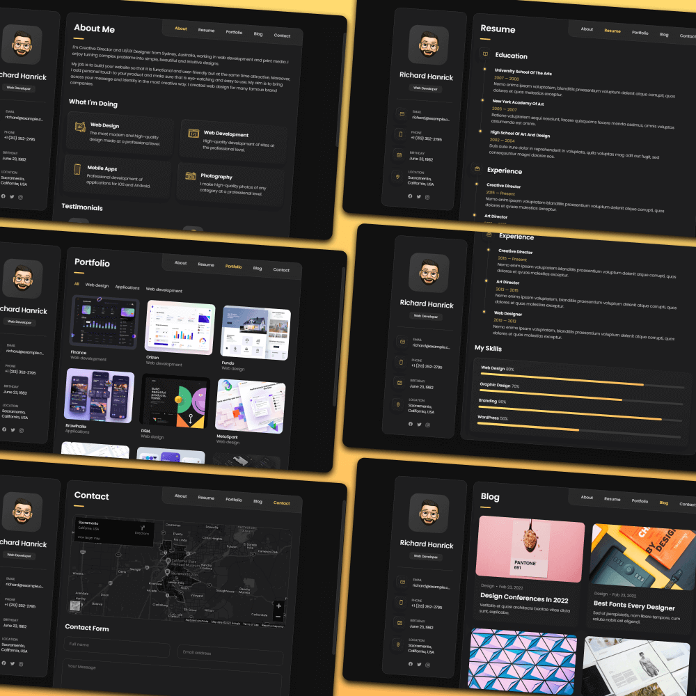
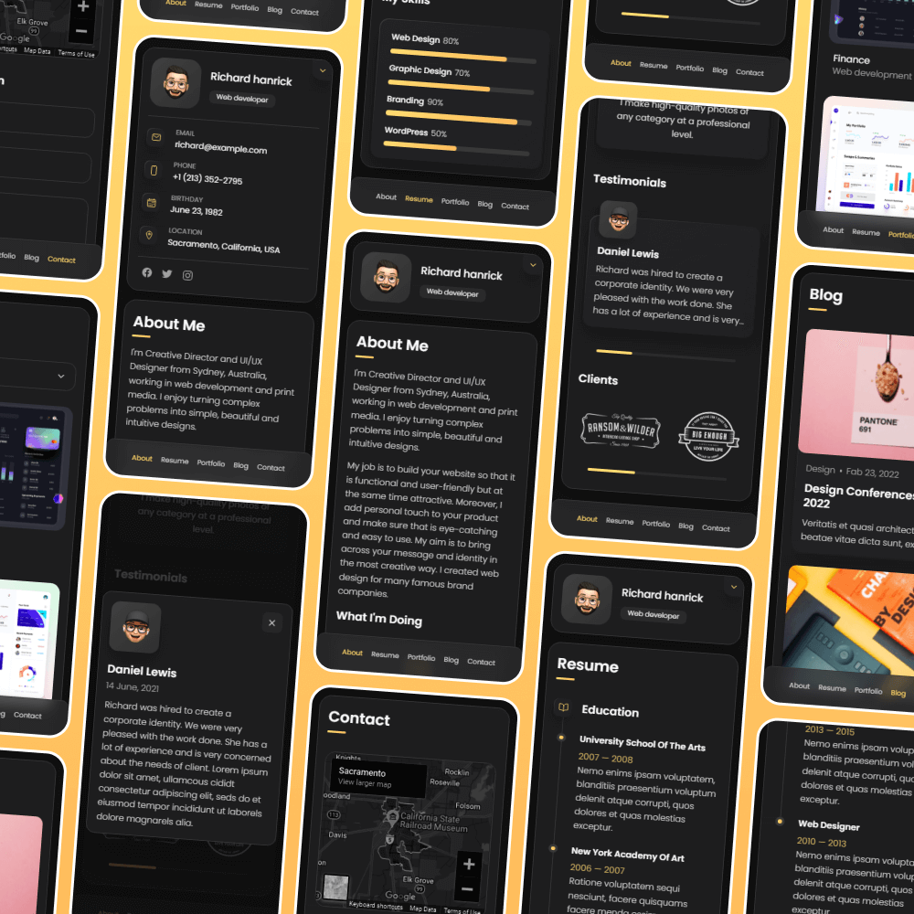

# vCard - Personal portfolio


[](https://twitter.com/intent/follow?screen_name=codewithsadee_)
[](https://youtu.be/SoxmIlgf2zM)

vCard is a fully responsive personal portfolio website, responsive for all devices, built using HTML, CSS, and JavaScript.

## Demo




## Prerequisites

Before you begin, ensure you have met the following requirements:

* [Git](https://git-scm.com/downloads "Download Git") must be installed on your operating system.

## Installing vCard

To install **vCard**, follow these steps:

Linux and macOS:

```bash
sudo git clone https://github.com/codewithsadee/vcard-personal-portfolio.git
```

Windows:

```bash
git clone https://github.com/codewithsadee/vcard-personal-portfolio.git
```

## Contact

If you want to contact me you can reach me at [Twitter](https://www.twitter.com/codewithsadee).

## License

MIT

## Updating the CV PDF

When changing the CSS or JavaScript, update the corresponding `?v=` value in
`index.html` so returning visitors load the matching files instead of cached ones.

The header downloads `assets/files/SeungJun-Tak-CV.pdf` directly. After updating
the CV content in `index.html`, regenerate this file so the website and PDF agree:

1. Open the local website in Chrome and use **Print → Save as PDF**.
2. Use A4 paper, 100% scale, and the default margins; turn off headers and footers.
   The print stylesheet arranges the full CV and hides navigation and video controls.
3. Save the result as `assets/files/SeungJun-Tak-CV.pdf`, check its content and page
   breaks, and include the updated PDF with the website changes.
